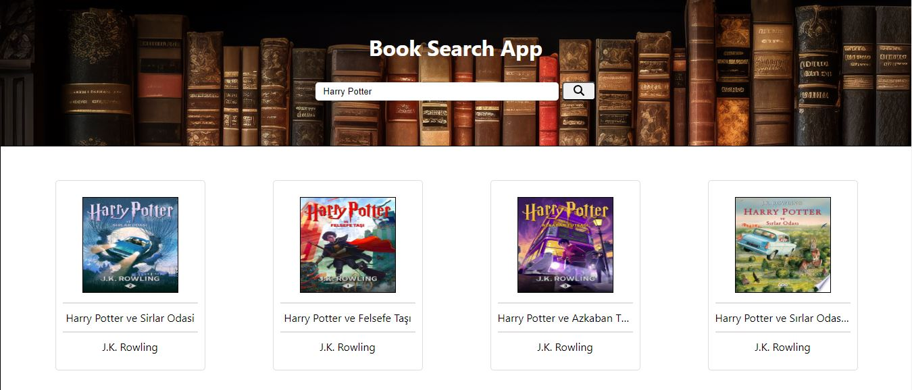
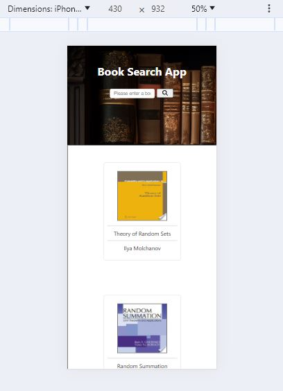

<h1>Book Search App</h1>
<p>The purpose of this application is to send a request to the API to fetch books according to the value entered in the input, so that the user can find the book she is looking for and buy it.</p>
<h2>Start and Run</h2>

In root directory,
```
`npm install` -- Install dependencies
`npm start` -- starts the application

 Open http://localhost:3000 to view it in your browser.

```
<div align="center">
<br/><br/><br/><br/>  

<br/><br/><br/><br/>

<br/><br/><br/><br/>

<br/><br/><br/><br/>  
</div>
